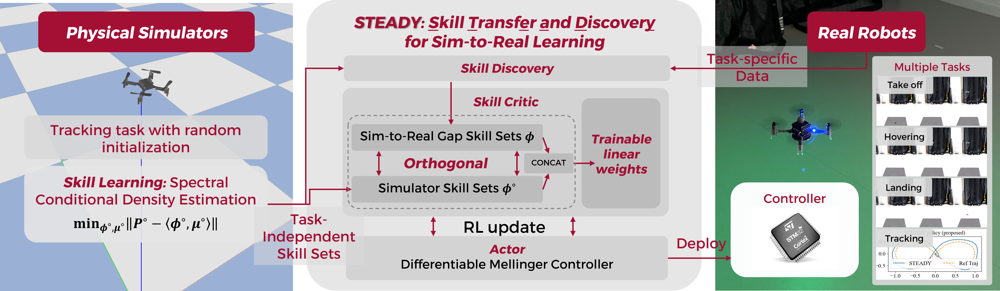
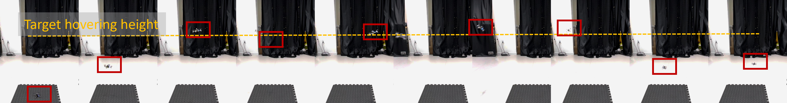
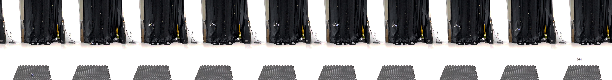

# STEADY: Skill TransfEr And DiscoveY for sim-to-real learning

This is the official implementation of 
[Skill Transfer and Discovery for Sim-to-Real Learning: A Representation-Based Viewpoint](https://arxiv.org/abs/2404.05051).

**TL;DR**: We use representation learning to improve sim-to-real transfer learning. For more experimental videos, see [our project homepage](https://congharvard.github.io/steady-sim-to-real/).
<figure style="text-align: center;">
  
  <figcaption>Stucture of STEADY sim-to-real learning</figcaption>
</figure>

We test the sim-to-real transfer on the crazyflie 2.1 drones,
<figure style="text-align: center;">
  
  <figcaption>Simulator policy</figcaption>
  
  <figcaption>Policy after tuning with STEADY algorithm</figcaption>
</figure>

## Offline/Simulator Training Setup

### Python environment

- create conda environement
  ```shell
  conda create -n drones python=3.10
  conda activate drones
  ```
- install pytorch according to https://pytorch.org/. CUDA highly recommended for faster training.


### clone and setup environment
```shell
git clone --recursive https://github.com/mahaitongdae/steady_sim_to_real.git
```

- install environments (No need to follow the readme inside):
  ```shell
  cd steady_sim_to_real
  cd deploy/envs/gym_pybullet/drones
  pip3 install -e .
  pip3 install gym tensorboardX seaborn
  ```

## offline training

```shell
python main_pyb.py
```

The training results will appear in the `log` folder.

## Online/Sim-to-Real Transfer Setup

### Hardware and software requirements


- [Crazyflie 2.x](https://www.bitcraze.io/documentation/tutorials/getting-started-with-crazyflie-2-x/)
  - We need a [SD card deck](https://www.bitcraze.io/products/micro-sd-card-deck/) for logging the real world data.
  Copy `./deploy/config.txt` to the SD card to log.
- I used [crazyswarm](https://github.com/USC-ACTLab/crazyswarm) to control the crazyflies. For detailed setups, please
refer to [crazyswarm documentation](https://crazyswarm.readthedocs.io/en/latest/).
  
  Crazyswarm usage:
  1. Install following https://crazyswarm.readthedocs.io/en/latest/installation.html.
  2. Configure your motion capture system following https://crazyswarm.readthedocs.io/en/latest/configuration.html#configuration.
  3. 
  
  Tips:
  - If localization is via motion capture systems, single marker setup is highly recommended.
  - When setup the motion capture system, remember to align the coordinates between the crazyflies and 
  mocaps.

- Crazyflie_firmware: For logging the experiment, we need to hack the hardware.

  Tips:
  - Get a ST-LINK V2 debugger is recommended for safe firmware flashing.

### online training
```shell
python main_onine.py
```

## Recommanded citation
```
@article{ma2024skilltransferdiscoverysimtoreal,
      title={Skill Transfer and Discovery for Sim-to-Real Learning: A Representation-Based Viewpoint}, 
      author={Haitong Ma and Zhaolin Ren and Bo Dai and Na Li},
      year={2024},
      eprint={2404.05051},
      archivePrefix={arXiv},
      primaryClass={cs.LG},
      url={https://arxiv.org/abs/2404.05051}, 
}
```


